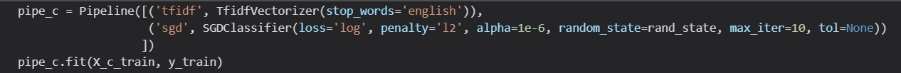
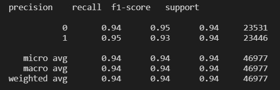
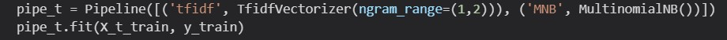
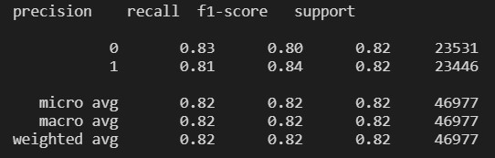
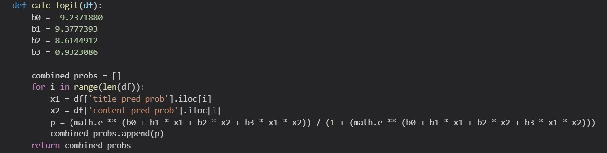
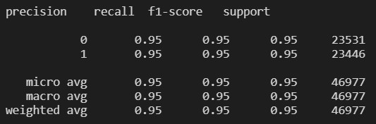

# CHECC News
## A Chrome Extension that predicts the reliability of news articles

In this fun project, I trained Machine Learning models to classify news articles as either reliable or unreliable. I used the following labeled news article datasets:
- https://www.kaggle.com/pontes/fake-news-sample
- https://www.kaggle.com/clmentbisaillon/fake-and-real-news-dataset/

### Data Preprocessing
I used **Python** to clean the datasets and train the models. To import and manipulate the data, I used the **Pandas** library. I chose the following columns to keep: title, content, type (reliable/unreliable). I cleaned the text data using **Regular Expressions**. The datasets had strong class bias because there was significantly more news articles that were classified as unreliable than reliable. I removed the class bias by randomly sampling the set of unreliable articles so that the number of reliable and unreliable articles were equal. I applied **one-hot encoding** to type to convert reliable to 1 and unreliable to 0. 

### Model Building and Training
#### Content Model

First, I built a model to predict reliability based on news article content. I used the **sci-kit learn** library to convert the texts into **tf-idf vectors** and to build a SGDClassifier with log loss and an alpha of 1e-6, which is a logistic regression model using Stochastic Gradient Descent learning. After trying different models and tuning various hyperparameters, I found this model to have the best results while maintaining a reasonable model size.

##### Content Model Accuracy Measures

Average f1-score of **94%**

#### Title Model

Then, I built a model to predict reliability based on the news article's title. I converted the texts into **tf-idf vectors** that includes both unigrams and bigrams. I then built a Multinomial Naive Bayes Classifier. After trying different models and tuning various hyperparameters, I found this model to have the best results while maintaining a reasonable model size.

##### Title Model Accuracy Measures

Average f1-score of **82%**

#### Combined Model

I wanted to see if I could use the outputs of the content and title models to make more accurate predictions. I used **R** to train a logisitc model using the the output data of the content and title models on the training data. I applied the resulting logistic function to the training data, and in testing, the accuracy improved slightly.

Average f1-score of **95%**

