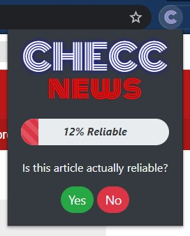

# CHECC News
## A Chrome Extension that predicts the reliability of news articles

In this fun project, I trained Machine Learning models to classify news articles as either reliable or unreliable. I used the following labeled news article datasets:
- https://www.kaggle.com/pontes/fake-news-sample
- https://www.kaggle.com/clmentbisaillon/fake-and-real-news-dataset/

### Data Preprocessing
I used **Python** to clean the datasets and train the models. To import and manipulate the data, I used the **Pandas** library. I chose the following columns to keep: title, content, type (reliable/unreliable). I cleaned the text data using **Regular Expressions**. The datasets had strong **class bias** because there was significantly more news articles that were classified as unreliable than reliable. I removed the **class bias** by randomly sampling the set of unreliable articles so that the number of reliable and unreliable articles were equal. I applied **one-hot encoding** to type to convert reliable to 1 and unreliable to 0. 

### Model Building and Training
#### Content Model

First, I built a model to predict reliability based on news article content. I used the **sci-kit learn** library to convert the texts into **tf-idf vectors** and to build a **SGDClassifier** with log loss and an alpha of 1e-6, which is a logistic regression model using **Stochastic Gradient Descent learning**. After trying different models and tuning various hyperparameters, I found this model to have the best results while maintaining a reasonable model size.

##### Content Model Accuracy Measures

Average f1-score of **94%**

#### Title Model

Then, I built a model to predict reliability based on the news article's title. I converted the texts into **tf-idf vectors** that includes both unigrams and bigrams. I then built a **Multinomial Naive Bayes Classifier**. After trying different models and tuning various hyperparameters, I found this model to have the best results while maintaining a reasonable model size.

##### Title Model Accuracy Measures

Average f1-score of **82%**

#### Combined Model

I wanted to see if I could use the outputs of the content and title models to make more accurate predictions. I used **R** to train a logistic model using the the output data of the content and title models on the training data. I applied the resulting logistic function to the training data, and in testing, the accuracy improved slightly.

#### Combined Model Accuracy Measures

Average f1-score of **95%**

### Chrome Extension

I built two versions of the Chrome Extension, both of which have th exact same functionaity. Version 1 uses **jQuery** for the front-end and **Flask** for the back-end. Version 2 uses **ReactJS** for the front-end and **Node.js** for the back-end.

#### Version 1

For the back-end, I used the **Flask** Python library to build a **REST API**  because this was the easiest way to integrate **sci-kit learn** models into the application. The **Flask** app creates a localhost server, and the Chrome Extension uses **POST** and **PUT** requests to exchange data with the server. The front-end of the Chrome Extension uses **HTML5**, **CSS3**, and **Javascript**. I also used the **Bootstrap 4** CSS framework and the **jQuery** Javascript library for easy styling, animations, and logic.

#### Version 2

For the back-end, I used **Node.js** with the **Express.js** framework to build a **REST API**. The script performs the same functionality as the the **Flask** server. The front-end is built with **React**, as well as **Bootstrap 4** and **HTML5**. **React** allowed for better structure and state management for my Chrome Extension. I wanted to try **React** because I had never used it before, and while certainly more difficult than **jQuery**, I found it was a much more organized and clean way to build the front-end of a website. 

#### Functionality

The user navigates to a news article, opens the Chrome Extension, and then clicks the *Submit* button. The extension then uses **jQuery AJAX**(Version 1) or **Axios** to send a **POST Request** with the URL of the article to the **Flask**/**Node** server. The **Flask**/**Node** script recieves the URL. The **Flask** script uses the **newspaper** Python library to extract the title and content on the article. The script then feeds the title and content through the **title model** and **content model** respectively. The outputs of each model are fed to the **combined model**, and a probability of the article being reliable is outputted. This probability is returned to the Chrome Extension in the **POST Request**. The extension then displays the probability. The **Node** script cannot directly used Python libraries to achieve much of what the **Flask** script can, so it calls a separate Python script using a child process. It sends the URL to the Python script, the script uses the **newspaper** library to extract article title and content, it runs those through the **sci-kit learn** models, and returns the results to the **Node** script, which sends the result to the **React** application. Using a child process is NOT an ideal or good solution to this problem because the **sci-kit learn** models have to be loaded upon every **POST** request to the **Node** server. This results in long loading times. It would be best to use a Python-based back-end in this scenario or a separate **Flask** server connected to the **Node** server that has the model preloaded. I only implemented it in the way I did because I wanted to learn basic **Node** and **Express**.

##### Reliable Article Output

##### Unreliable Article Output

##### Unsupported Article Output

If the user clicks *Submit* when on a webpage that is not an article or on a webpage on which the **newspaper** library cannot extract text from the URL, the following error message is displayed:

##### Model Feedback

To account for incorrect article reliability predictions, I included a report feature. As you can see above, after the user receives the probability, they can report if the article was actually reliable or not. When the user clicks *Yes* or *No*, a **PUT Request** sends the feedback value to the **Flask**/**Node** server. The server stores the URL, title, and content of the article in a **JSON** file. *Correct* and *Incorrect* data values are stored separately. This data could be uses in the future to further improve the models. 

